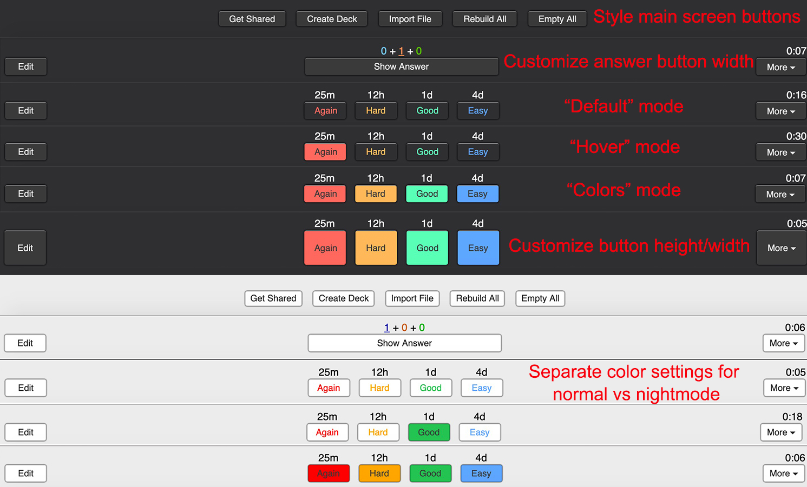

# Button-Colors Redesigned and Customizable
 Button add-on that lets you customize multiple parts of the main screen and answer buttons including colors, size and a confirmation tooltip.

<source src="screenshots/ButtonsConfirmation.mov" type="video/mov">

See this link for Ankiweb download and details: 
 

---
**Please consider supporting us via:**

* **[Patreon](https://www.patreon.com/ankingmed)**- _Get individualized Anki, Premed or Med school help_
* **[YouTube](https://www.youtube.com/theanking)**- _Anki tutorials_
* **[Website](https://www.ankingmed.com)**- _USMLE Step 1 deck, discount codes, recommended add-ons, etc_
* **[Instagram](https://www.instagram.com/ankingmed)**/**[Facebook](https://www.facebook.com/ankingmed)**
